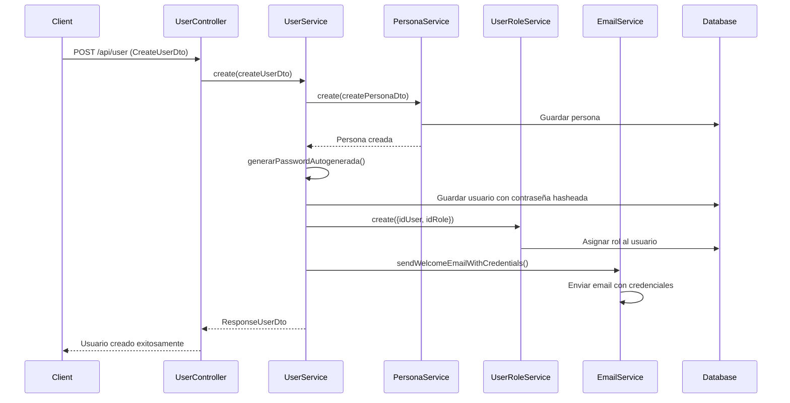

# Sistema de Creación de Usuarios con Email Automático

## Descripción General

El sistema de creación de usuarios ha sido actualizado para generar automáticamente contraseñas seguras y enviar emails de bienvenida con las credenciales de acceso a los nuevos usuarios.

## Cambios Implementados

### 1. Actualización del DTO de Creación

**Archivo:** `src/modules/users/dto/user/create-user.dto.ts`

- ✅ **Eliminado:** Campo `contrasena` del DTO
- ✅ **Mejorado:** Validaciones y documentación con Swagger
- ✅ **Añadido:** Comentarios JSDoc explicativos

```typescript
export class CreateUserDto {
  @IsEmail({}, { message: 'Debe proporcionar un email válido' })
  email: string;
  
  idRol: number;
  createPersonaDto: CreatePersonaDto;
  // Campo 'contrasena' removido - se genera automáticamente
}
```

### 2. Actualización del UserService

**Archivo:** `src/modules/users/services/user.service.ts`

#### Cambios principales:
- ✅ **Inyección:** EmailService agregado al constructor
- ✅ **Generación automática:** Contraseña siempre generada por el sistema
- ✅ **Email automático:** Envío de credenciales al usuario
- ✅ **Manejo de errores:** El fallo del email no afecta la creación del usuario

```typescript
async create(createUserDto: CreateUserDto): Promise<ResponseUserDto> {
  // 1. Crear persona
  const persona = await this.personaService.create(createUserDto.createPersonaDto);
  
  // 2. Generar contraseña automáticamente
  const passwordPlano = this.generarPasswordAutogenerada();
  const passwordHasheada = await hash(passwordPlano, 10);
  
  // 3. Crear y guardar usuario
  const userSaved = await this.userRepository.save(user);
  
  // 4. Asignar rol
  await this.userRoleRepository.create({...});
  
  // 5. Enviar email de bienvenida
  await this.emailService.sendWelcomeEmailWithCredentials(
    email, nombre, passwordPlano
  );
}
```

### 3. Nuevo Método en EmailService

**Archivo:** `src/modules/users/services/email.service.ts`

#### Método agregado:
```typescript
async sendWelcomeEmailWithCredentials(
  email: string, 
  nombre: string, 
  password: string
): Promise<EmailResponse>
```

#### Características del email:
- 📧 **Asunto:** "Bienvenido al Sistema Contable - Credenciales de Acceso"
- 🎨 **Diseño:** HTML responsivo y profesional
- 🔐 **Credenciales:** Email y contraseña temporal claramente mostrados
- ⚠️ **Advertencia de seguridad:** Recomendación de cambiar contraseña
- 📱 **Versión texto:** Fallback para clientes que no soportan HTML

## Flujo de Creación de Usuario



## Seguridad

### Generación de Contraseñas
- **Método:** `randomBytes()` de Node.js crypto
- **Longitud:** 12 caracteres por defecto
- **Codificación:** Base64 para caracteres seguros
- **Hashing:** bcrypt con salt rounds = 10

### Manejo de Credenciales
- ✅ Contraseña solo visible en el email inicial
- ✅ Contraseña hasheada en base de datos
- ✅ Recomendación explícita de cambio de contraseña
- ✅ No se almacena la contraseña en texto plano

## Manejo de Errores

### Fallo en Envío de Email
- ❌ **No bloquea:** La creación del usuario continúa
- 📝 **Log:** Error registrado en consola
- 🔄 **Recuperación:** Usuario puede solicitar reset de contraseña

### Validaciones
- ✅ Email válido requerido
- ✅ Datos de persona completos
- ✅ Rol válido existente

## Configuración Requerida

### Variables de Entorno
```env
# Email Configuration
USER_EMAIL=tu-email@gmail.com
USER_PASSWORD=tu-app-password
SMTP_HOST=smtp.gmail.com
SMTP_PORT=587

# Frontend URL (para links en emails)
FRONTEND_URL=http://localhost:3000
```

## Uso de la API

### Endpoint
```http
POST /api/user
Content-Type: application/json

{
  "email": "usuario@ejemplo.com",
  "idRol": 1,
  "createPersonaDto": {
    "primerNombre": "Juan",
    "segundoNombre": "Carlos",
    "primerApellido": "Pérez",
    "segundoApellido": "García",
    "fechaNacimiento": "1990-01-01",
    "telefono": "+1234567890",
    "dni": "12345678"
  }
}
```

### Respuesta Exitosa
```json
{
  "id": 1,
  "email": "usuario@ejemplo.com",
  "habilitado": true,
  "persona": {
    "primerNombre": "Juan",
    "primerApellido": "Pérez"
  }
}
```

## Beneficios

1. **🔒 Seguridad mejorada:** Contraseñas generadas automáticamente
2. **📧 Comunicación automática:** Usuario recibe credenciales inmediatamente
3. **🎯 Experiencia de usuario:** Proceso simplificado de registro
4. **⚡ Eficiencia:** Menos pasos manuales para administradores
5. **🛡️ Consistencia:** Todas las contraseñas siguen el mismo estándar de seguridad

## Próximos Pasos Recomendados

1. **🔄 Cambio de contraseña obligatorio:** Implementar flujo que fuerce cambio en primer login
2. **📊 Auditoría:** Registrar eventos de creación de usuarios
3. **🔔 Notificaciones:** Sistema de notificaciones para administradores
4. **📱 Templates:** Personalización de plantillas de email por organización
5. **🌐 Internacionalización:** Soporte para múltiples idiomas en emails